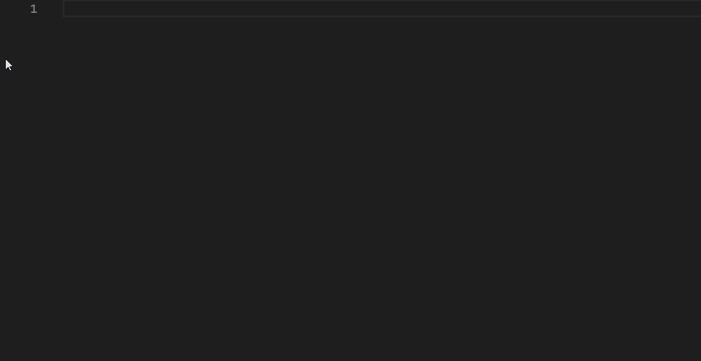

# MDB 5 Standard Code Snippets

This extension adds snippets for MDB 5 Standard - Material Design for Bootstrap 5 UI KIT

<!--  -->

## Usage

Type part of snippet selector and press `enter`.

Alternatively, press `Ctrl`+`Space` (Windows, Linux) or `Cmd`+`Space` (Mac OS) to display snippets list.

## Snippets list

You can find list of available snippets below:

### Fundamentals

| Snippet              | Description      |
| -------------------- | ---------------- |
| `s-mdb-html-starter` | MDB HTML starter |
| `s-mdb-basic-layout` | MDB Basic layout |

### Layout

| Snippet               | Description              |
| --------------------- | ------------------------ |
| `s-mdb-grid-2col`     | MDB Grid 2 columns       |
| `s-mdb-grid-3col`     | MDB Grid 3 columns       |
| `s-mdb-grid-4col`     | MDB Grid 4 columns       |
| `s-mdb-grid-centered` | MDB Grid centered column |
| `s-mdb-section`       | MDB Section              |

### Content & styles

| Snippet               | Description       |
| --------------------- | ----------------- |
| `s-mdb-hover-effects` | MDB Hover effects |
| `s-mdb-icon`          | MDB Icon          |
| `s-mdb-note`          | MDB Note          |

### Navigation

| Snippet                  | Description               |
| ------------------------ | ------------------------- |
| `s-mdb-footer`           | MDB Footer                |
| `s-mdb-header-jumbotron` | MDB Header with jumbotron |
| `s-mdb-header-image`     | MDB Header with image     |
| `s-mdb-navbar`           | MDB Navbar                |
| `s-mdb-pagination`       | MDB Pagination            |
| `s-mdb-pills`            | MDB Pills                 |

### Components

| Snippet                 | Description         |
| ----------------------- | ------------------- |
| `s-mdb-button`          | MDB Button          |
| `s-mdb-button-link`     | MDB Button link     |
| `s-mdb-button-floating` | MDB Button floating |
| `s-mdb-button-social`   | MDB Button social   |
| `s-mdb-card`            | MDB Card            |
| `s-mdb-card-empty`      | MDB Card empty      |
| `s-mdb-card-image`      | MDB Card image      |
| `s-mdb-card-complex`    | MDB Card complex    |
| `s-mdb-list-group`      | MDB List group      |
| `s-mdb-modal`           | MDB Modal           |

### Forms

| Snippet          | Description  |
| ---------------- | ------------ |
| `s-mdb-form`     | MDB Form     |
| `s-mdb-checkbox` | MDB Checkbox |
| `s-mdb-radio`    | MDB Radio    |
| `s-mdb-input`    | MDB Input    |
| `s-mdb-textarea` | MDB Textarea |

### Data

| Snippet       | Description |
| ------------- | ----------- |
| `s-mdb-table` | MDB Table   |

### Utilities

| Snippet              | Description      |
| -------------------- | ---------------- |
| `s-mdb-embed`        | MDB Embed        |
| `s-mdb-ripple-color` | MDB Ripple color |
| `s-mdb-divider`      | MDB Divider      |

## Installation

1. Launch Visual Studio Code
2. Go to extensions tab - `Ctrl`-`Shift`-`X` (Windows, Linux) or `Cmd`-`Shift`-`X` (OSX)
3. Search for 'MDB 5 Standard snippets'
4. Choose the extension
5. Install extension and reload Visual Studio Code
